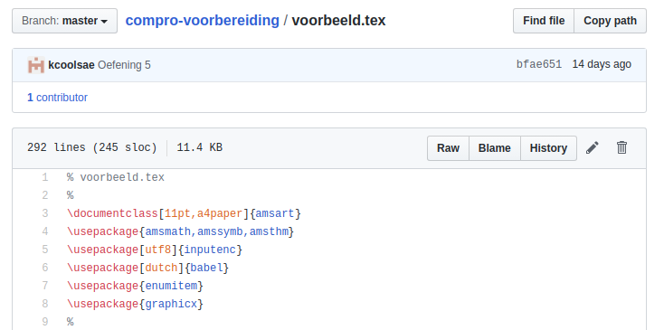

Bestanden downloaden vanaf deze website
===

Deze website maakt gebruik van *Github*-software (wordt bewaard op/beheerd door een *github*-server), een
instrument dat zeer populair is bij informatici en ook wordt gebruikt 
in andere vakken (bijvoorbeeld bij *Programmeren*).

Als je niet gewoon bent om met *github* te werken, kan het even
duren voor je doorhebt hoe je een bestand van *github* naar je eigen computer overbrengt. 
Daarom deze uitleg.  

Merk op: hoewel je vanop deze pagina's in de eerste plaats LaTeX-bestanden zult
downloaden, werken onderstaande instructies ook voor andere soorten bestanden.
Deze toelichting heeft op zich helemaal niets met LaTeX te maken.

### Hoe downloaden?

Wanneer je op een link klikt van een LaTeX-bestand, kom je op een pagina terecht
waarin je dat LaTeX-bestand wel kunt 'lezen' en bekijken, maar 
die tegelijk ook heel wat meer informatie bevat over dat bestand, zoals je ziet
in onderstaande schermafbeelding:

Om het bestand zelf te downloaden - in dit geval `voorbeeld.tex` - klik je op
de knop **Raw** (in de grijze titelbalk). Je krijgt dan het
bestand in de browser te zien in zijn 'rauwe' vorm.

Klik nu rechts in het browservenster en kies '*Bewaar als…*'
of '*Save as…*'. Let er op dat de naam waarmee je dit bestand 
bewaart wel degelijk als extensie **.tex** heeft (en niet .txt wat 
door sommige browsers wordt voorgesteld1).

Het is mogelijk dat je besturingssysteem bij het downloaden een poging doet
om het bestand te openen en misschien zelfs vraagt met welk programma
hij dit moet doen - iets wat hier weinig zin heeft. Zorg er
in de plaats voor dat het bestand 
gewoon ergens op je harde schijf wordt bewaard. Het is best mogelijk 
dat de browser
het bestand op dat moment al vanzelf in je *Downloads*-map heeft geplaatst.  

Opmerkingen:

* Je kan een stapje overslaan door rechts op de Raw-knop te klikken met de muis
en daar meteen '*Bewaar als…*' te kiezen.
* Voor afbeeldingsbestanden heet de Raw-knop **Download**.

---

#### Voetnoten

1 Het kan zijn dat je computer zo ingesteld is dat je bij het downloaden de extensie van je bestand niet
in `.tex` kunt veranderen. Gebruik in dat geval `.txt` en verander de extensie in Overleaf nadat je het 
bestand hebt geüpload (drie puntjes-menu bij de bestandsnaam, kies *Rename*)
