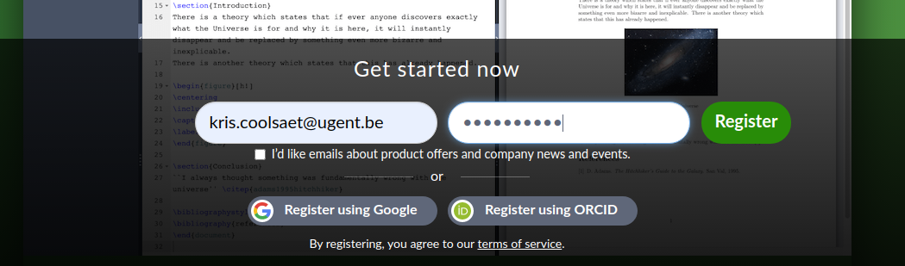
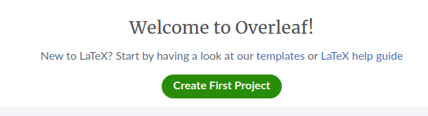
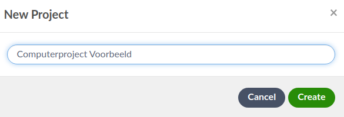
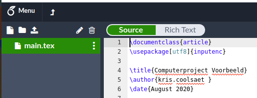
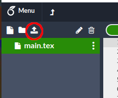
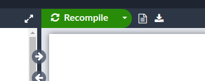
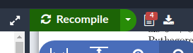
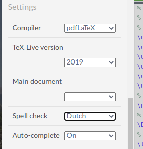

Overleaf
===

Zoals we al in de [inleiding over LaTeX](latex.md) hebben gezegd, gebruiken 
we in deze lessen **Overleaf** als LaTeX-platform. Met Overleaf kan je
LaTeX-broncode intikken en omzetten naar (afdrukbare) PDF met behulp van de onderliggende
LaTeX-processor.

Overleaf bevindt zich in de '[Cloud](https://nl.wikipedia.org/wiki/Cloud_computing)': je hebt enkel een Internetbrowser
nodig om die (gratis) software te gebruiken, Je LaTeX-bestanden worden in de 'Cloud' 
bewaard, maar kunnen ook van en naar je computer worden verplaatst.

Opstarten
---
Om Overleaf te gebruiken, moet je je eerst (eenmalig) registreren. Dit doe
je op de volgende manier: 

* Surf naar de website van Overleaf ([www.overleaf.com](https://www.overleaf.com)).
* Vul je UGent-e-mailadres in en een wachtwoord dat je gemakkelijk kan onthouden.
  (niet het wachtwoord van je UGent-account!) en druk op Register1.
  
  
* Overleaf groet je met een scherm waarmee je je eerste project kan aanmaken.   
    
    
* Druk op 'Create first project' en kies een naam voor je project. Wij kozen voor 'Computerproject Voorbeeld', maar je mag gerust creatief zijn.

  

(Meer over [projecten](#projecten) onderaan de pagina.)  
 
Bij een nieuw project maakt Overleaf meteen een nieuw LaTeX-bestand
aan met de naam `main.tex`, zoals je kan zien in de balk aan de linkerkant
van je scherm.

Je hebt nu twee opties:
* Ofwel pas je de broncode aan in `main.tex`. In de praktijk is dit vaak 
de gemakkelijkste oplossing wanneer je een wiskundetekst helemaal vanaf nul 
aan het opbouwen bent. 

In de lessen zullen we je echter telkens een bestand geven
 waarin al heel wat tekst staat2, dus is in dit geval de tweede optie
 de beste: 

* Ofwel vervang je dit bestand door een bestand dat je uploadt vanop je computer.

Als voorbeeld gebruiken we het bestand `voorbeeld.tex`. 
Lees [hier](downloaden.md) hoe je dit bestand kan downloaden vooraleer je op deze 
[link](voorbeeld.tex) klikt. Onthoud waar je het bewaard hebt.

* Linksboven op de Overleaf-pagina staat een knop waarmee je bestanden kunt uploaden.
 
  

  Gebruik die knop om het bestand dat je daarjuist hebt gedownload naar Overleaf te uploaden.
  In de balk aan de linkerkant van het scherm staat nu ook `voorbeeld.tex`.

* Selecteer dit bestand en klik op *Recompile* (linksboven in de rechterhleft van het scherm). 
    
  
    
  Hiermee vraag je de LaTeX-processor om jouw LaTeX-bestand (in de linkerhelft
  van het scherm) om te zetten naar een PDF-bestand. Als alles goed gaat, 
  verschijnt nu het PDF-bestand in de rechterhelft van je browserscherm.
  
* Als je goed oplet, merk je dat toch niet alles perfect is gelopen. De LaTeX-processor
  signaleert 4 fouten in de broncode. Dit zie je aan het embleempje naast de Recompile-knop
  
  
  
  en ook aan de rode kruisje in de marge van de broncode (linkerhelft). 
  
  Ons voorbeeld gebruikt namelijk twee afbeeldingen die Overleaf niet terugvindt,
  omdat we die nog niet hebben geüpload.
  
* Upload deze twee afbeeldingsbestanden naar Overleaf (in hetzelfde project): 
  [Pythagorean_proof.png](Pythagorean_proof.png) en [P_triangle.png](P_triangle.png). Let erop
  dat je de hoofd- en kleine letters in de namen precies overneemt3 en dat de
  bestanden als extensie **.png** behouden.
  
* Druk opnieuw op *Recompile*: de foutmelding verdwijnt en de 
afbeeldingen zijn nu opgenomen in het PDF-bestand (blz. 2 en 3).

* Je mag het bestand `main.tex` eventueel uit het project verwijderen: klik
rechts 
op de naam van het bestand in de balk aan de linkerkant en kies *Delete*. 

### Projecten

Overleaf organiseert je werk in afzonderlijke *projecten* (= mappen). Elk project bevat
één of meerdere LaTeX-broncodebestanden samen met alle afbeeldingsbestanden
die erbij horen. Voor *Computerproject Wiskunde* heb je een aantal keuzes:

* Maak een nieuw project aan voor elke oefening.
* Maak één enkel project aan voor alle oefeningen van het semester. (Maar dit
wordt op de duur wel wat onoverzichtelijk.)
* Maak één project aan per lesweek. (De gulden middenweg?)

### Verdere informatie

* Als je later opnieuw terugkeert naar de Overleaf-website 
zal hij wellicht vanzelf je laatste project en je laatste bestand opnieuw openen. 
Is dit niet zo, dan moet je opnieuw inloggen. Er staat een *Log In*-knop helemaal
  bovenaan rechts op de [startpagina](https://www.overleaf.com).

* Misschien heeft Overleaf niet door dat je tekst in het Nederlands is geschreven
  en staan er overal van die rode *wiebels* onder je woorden. Je kan de
  taal voor de spellingscontrole instellen via het *Menu* aan de linkerkant.  

  
* Om (de broncode van) een project te downloaden, open je het *Menu* en 
klik je op het *Source*-pictogram. Je krijgt dan een ZIP-archief met daarin
alle bestanden uit het project.  

* Overleaf biedt nog heel wat andere opties die je terugvindt op hun uitgebreide
[documentatiewebsite](https://www.overleaf.com/learn) (in het Engels). Je vindt
er niet alleen documentatie over de Overleaf-software, maar ook over LaTeX zelf.

---

#### Voetnoten

1 De schermafbeelding op deze pagina zijn gemaakt op een *Chrome*-browser
op een *Linux*-computer. Bij jou kan het er iets anders uitzien. 

2 Computerproject wiskunde ≠ typles voor beginners.

3 Het besturingssysteem Windows houdt geen rekening met het verschil
tussen hoofd- en kleine letters in bestanden, maar Linux en MacOS doen dit wel, en
software in de 'Cloud' meestal ook. Dit is helaas een veelvoorkomende bron van
fouten bij beginnende LaTeX-auteurs.

