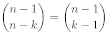

LaTeX-oefeningen Week 1
===

### Algemene aandachtspunten

Wiskundige formules zet je in wiskunde'modus' (*math mode*), 
ofwel 'in de tekst' (*inline mode* - `\(...\)` of `$...$`), ofwel 'losstaand' (*display mode* - `\[...\]`).
Gebruik *nooit* het verouderde `$$...$$` voor display mode, want dit kan vreemde conflicten opleveren.
Vergeet niet dat math mode ook noodzakelijk is voor éénlettervariabelen (zoals *a* in 'het kwadraat van *a* is ...'). Positieve getallen die
op zichzelf staan (zoals 12 in 'er zijn 12 maanden') mogen in tekst'modus' gezet worden (*text mode*), maar dat is een
kwestie van persoonlijke voorkeur. Negatieve getallen moet je steeds in wiskundemodus plaatsen - een min-teken ziet er namelijk anders uit dat
een enkel tekststreepje.

Losstaande formules hoef je echter niet in een afzonderlijke alinea te plaatsen. Doe je dit wel,
dan zal het eindresultaat er anders uitzien: de tekst na de formule springt in, er komt 
bijkomende witruimte voor en/of na de formule, … (Het exacte effect hangt af van de gebruikte LaTeX-stijl.)

Titels van hoofdstukken en paragrafen mag je niet zelf nummeren, centreren, vetjes maken, … LaTeX
heeft `\chapter`, `\section` en `\subsection`-opdrachten die dit voor jou doen. Bij artikels in tijdschriften zijn er geen hoofdstukken en is het hoogste
indelingsniveau een *section*.

In gedrukte teksten hebben aanhalingstekens die open gaan doorgaans een andere vorm dan aanhalingstekens
die dichtgaan. Omdat LaTeX niet zomaar kan raden welke aanhalingstekens open moeten gaan en welke dicht - zinnen zoals 
' 's Avonds bekijken we enkele TV-programma's ' maken dit niet gemakkelijk - moeten we
dit zelf in de LaTeX-broncode aangeven. Gebruik een 'achterwaarts' aanhalingsteken (*backquote*, *backtick*, *accent grave* `` ` ``) om aanhalingstekens
te openen, en het gewone aanhalingsteken (`'`) om ze terug te sluiten, zoals in dit `` `voorbeeld' ``. 
Voor dubbele aanhalingstekens gebruik je *niet* het letterteken `"` op je toetsenbord, maar
verdubbel je de achterwaartse en voorwaarste aanhalingstekens (``` ``voorbeeld'' ```).

Woorden met accenten, zoals café, garçon, à point, coëfficiënt, ... tik je gewoon in zoals je dit in een tekstverwerker
zou doen. In oude LaTeX-teksten en -handboeken vind je hiervoor speciale notaties (`caf\'e, gar\c con, …`). Gebruik die *niet*, ze maken je LaTeX-bestand
minder leesbaar en zorgen voor problemen bij het automatisch splitsen van woorden.

### Oefeningen

Oefening 1: [Verwacht eindresultaat](latex-oef1.pdf) (PDF) | Vertrek van dit [LaTeX-bestand](latex-oef1.tex).

Oefening 2: [Verwacht eindresultaat](latex-oef2.pdf) (PDF) | Vertrek van dit [LaTeX-bestand](latex-oef2.tex).

* Het punt dat je in LaTeX gebruikt om een vermenigvuldiging aan te duiden, is niet hetzelfde als het punt
waarmee je het einde van een zin aangeeft. (Het is iets kleiner en staat iets hoger op de lijn.)
* Drie opeenvolgende puntjes (…) in een product noteer je *niet* als drie opeenvolgende
punten in het LaTeX-bestand.
* Linker- en rechterzijde in onderstaande formule zijn *binomiaalcoëfficiënten*, geen matrices.
 
  
* In de breuken die in de noemer twee faculteiten bevatten, zijn die faculteiten gescheiden
door een 'dikke spatie' (*thick space*) die je zelf moet zetten. LaTeX kent verschillende (korte) opdrachten
voor horizontale spatiëring in wiskundemodus.

Oefening 3: [Verwacht eindresultaat](latex-oef3.pdf)<sup>1</sup> (PDF) | Vertrek van dit [LaTeX-bestand](latex-oef3.tex).

* Schrijf je in je LaTeX-bestand letterlijk `cos x`, dan zal het eindresultaat er ongeveer zo uitzien: *c o s x* 
(maar met iets minder tussenruimte tussen de afzonderlijke letters). In wiskundemodus negeert LaTeX namelijk
spaties en interpreteert hij opeenvolgende lettertekens
als variabelen die met elkaar moeten vermenigvuldigd worden: c maal o maal s maal x - je had dus evengoed `cosx` kunnen schrijven, of `c o s x`.
LaTeX voorziet speciale opdrachten voor goniometrische functies die voor de juiste spatiëring zorgen en het juiste lettertype - de 'cos' in 'cos *x*' staat
namelijk niet cursief zoals andere letters in wiskundemodus.
* Merk op dat de gelijkheidstekens in de lijsten van goniometrische formules netjes onder elkaar
staan uitgelijnd. LaTeX biedt heel wat verschillende manieren om dit te verwezenlijken. In deze oefening, en in de meeste
oefeningen die volgen, gebruiken we hiervoor een `align*`-omgeving (`align*` *environment* - vergeet het sterretje niet!). Merk op dat
een dergelijke omgeving automatisch in 'alleenstaande wiskundemodus' wordt gezet, je mag errond geen
`\[…\]` plaatsen.

---

#### Voetnoten

<sup>1</sup> De oefeningen zijn geïnspireerd op Wikipedia-artikelen. Soms bevatten ze wat te veel herhaling. 
Je hoeft je niet altijd verplicht te voelen om de oefening exact te laten lijken op het verwachte eindresultaat. 
In oefening 3 kan je bijvoorbeeld
in elk van de laatste drie 'lijsten' van formules telkens de helft ervan overslaan.
