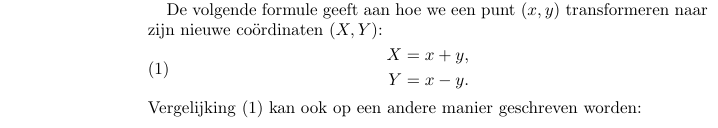
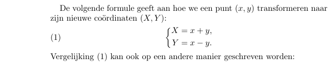

LaTeX-oefeningen Week 2 - deel 2
===

### Algemene aandachtspunten

LaTeX biedt diverse manieren1 aan om matrices en determinanten af te beelden. 
Wij gebruiken
de `pmatrix`-, `vmatrix`-, …-omgevingen, het ganse lijstje vind je bijvoorbeeld 
[hier](https://www.math-linux.com/latex-26/faq/latex-faq/article/how-to-write-matrices-in-latex-matrix-pmatrix-bmatrix-vmatrix-vmatrix). 
(Merk op dat LaTeX een determinant beschouwt als een matrix
met verticale lijnen als 'haakjes'.)

Je kan in LaTeX ruwweg drie soorten omgevingen onderscheiden, afhankelijk 
van de modus waarin je ze gebruikt:
* Omgevingen voor tekstmodus, zoals `enumerate` of `itemize`
* Omgevingen voor wiskundemodus, zoals `pmatrix` en `vmatrix`
* Omgevingen die zelf wiskundemodus opstarten, zoals `equation` en `align*`

Deze laatste zorgen vanzelf voor alleenstaande formules zonder dat je er nog `\[…\]` hoeft rond te plaatsen2 (lees: *mag* rondzetten).

Als variant op `align*` bestaat er ook de `aligned`-omgeving die precies hetzelfde doet, behalve dat
`aligned` enkel mag gebruikt worden op plaatsen waar je je reeds in wiskundemodus bevindt. (Het is dus een omgeving van de 2e soort in plaats van de 3e soort.) 
De `aligned`-omgeving is nuttig voor die situaties waarin je behalve uitgelijnde
kolommen ook nog wat bijkomende elementen in dezelfde 'formule' wil opnemen, bijvoorbeeld
wanneer je de formule een nummer wil geven3.

Bovenstaande hebben we op de volgende manier genoteerd:

    \begin{equation}
    \label{eq-1}
    \begin{aligned}
        X &= x + y,\\
        Y &= x - y.
    \end{aligned}
    \end{equation}
    
Vanuit wiskundig oogpunt is een accolade misschien
duidelijker:

 
   
Hiervoor gebruikten we een `\left`-`\right`-combinatie:

    \begin{equation}
    \label{eq-1}
    \left\{
    \begin{aligned}
        X &= x + y,\\
        Y &= x - y.
    \end{aligned}
    \right.
    \end{equation}
    
Meer uitleg over deze `\left`-`\right`-combinatie, vind je bijvoorbeeld
[hier](https://www.overleaf.com/learn/latex/Brackets_and_Parentheses). Zoals ook daar
vermeld staat, moet elke `\left` een corresponderende `\right` hebben, maar niet noodzakelijk
met dezelfde 'haak'. Desnoods gebruik je een *onzichtbare haak* - genoteerd
met een punt, zoals in bovenstaand voorbeeld.

### Oefeningen

Oefening 6: [Verwacht eindresultaat](latex-oef6.pdf) (PDF) | Vertrek van dit [LaTeX-bestand](latex-oef6.tex).

* Deze oefening gebruikt een andere LaTeX-stijl dan in de vorige oefeningen. Je merkt dit voornamelijk
aan kleine dingen: de titels zien er lichtjes anders uit - merk in het bijzonder de `\paragraph`-titel 'Voorbeeld.' onderaan blz. 2 - en de
volgnummers van formules staan nu aan de rechter- in plaats van de linkerkant.
* Dit is ook de eerste oefening waarbij het artikel een *titel*, *auteur* en 
*datum* heeft.
Titels en auteurs mag je niet zelf zetten, maar dat moet je overlaten aan LaTeX. Dit gebeurt
in twee stappen: 
  * Je *definieert* titel e.d. met `\title`, `\author`, `\date` in de zogenaamde *preambule* - bovenaan
in het LaTeX-bestand, vóór de `\begin{document}`. 
  * Je plaatst `\maketitle` in de tekst zelf
op de plaats waar je de titelgegevens wil zien verschijnen (meestal is dat onmiddellijk na
de `\begin{document}`).

  Je ziet dit o.a., aan het werk in het [voorbeeld uit de inleidingsles](voorbeeld.tex).
 
* Nog een paar kleine details waar je bij oefening 6 moet opletten: 
  * De `&` in de titel
  kan je niet zomaar overnemen in je LaTeX-bestand. Het teken `&` heeft een bijzondere
  betekenis in LaTeX. (Het scheidt kolommen van elkaar in bijvoorbeeld een `align*`.)
  * Het streepje in de datum `2014-2015` is geen gewoon streepje (en staat in tekstmodus!).  
  * De definitie van de matrices P en C in paragraaf §1.2 wordt gezet 
  in wiskundemodus, en *niet* in een tekstparagraaf die je dan op 
  één of andere manier centreert. Opdat LaTeX het woord 'en' als tekst zou interpreteren,
  en niet als het product van *e* en *n*, moet je een bepaalde LaTeX-opdracht gebruiken.
  Tip: in het [voorbeeld uit de inleidingsles](voorbeeld.tex) 
  wordt dit ergens toegepast in paragraaf §1.3. 
  
---
  
#### Voetnoten

1 Wiskundigen gebruiken al meer dan veertig jaar LaTeX - of zijn voorganger TeX - om wiskundige teksten te zetten met
de computer. Tijdens die periode heeft het systeem verschillende evoluties meegemaakt (TeX, LaTeX, LaTeX2e, AMS-LaTeX, …)
die allemaal min of meer met elkaar verenigbaar zijn gebleven. Bovendien hebben
heel wat mensen in de loop der tijden bijkomende pakketten aan LaTeX toegevoegd
voor *features* die op dat moment ontbraken, maar ondertussen misschien wel standaard aanwezig zijn.

Om een lang verhaal kort te maken: het is dus helemaal niet verwonderlijk dat
er in LaTeX vaak verschillende manieren bestaan om hetzelfde te bereiken, en 
het is niet altijd gemakkelijk om voor jezelf uit te maken welke van de
aangeboden methoden nu de 'beste' is. Het helpt ook niet dat wiskundigen doorgaans die versie van TeX/LaTeX blijven gebruiken die
 ze zelf oorspronkelijk hebben geleerd. En van elk van die versies vind je voorbeelden op het Internet…  
 
2 `\[…\]` is eigenlijk een afkorting van

    \begin{equation*}
    …
    \end{equation*}    
een omgeving van de 2e soort.

3 Er is ook een `align`-omgeving (van de 3e soort - zonder sterretje, zonder 'ed') 
waarmee je lijsten van gelijkheden kunt nummeren, maar die geeft een afzonderlijk
nummer aan elk onderdeel van de lijst, en niet één nummer voor de ganse lijst,
zoals in ons voorbeeld.